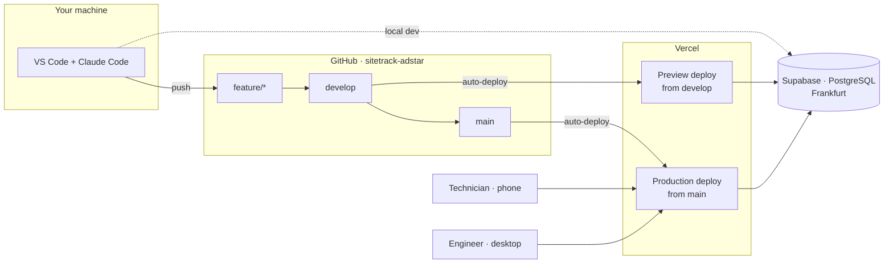
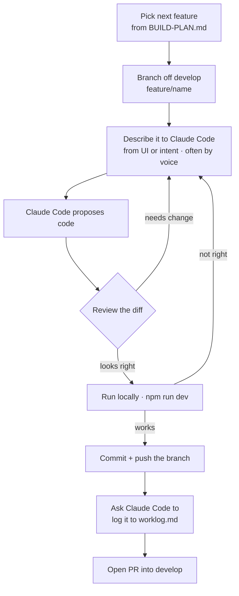
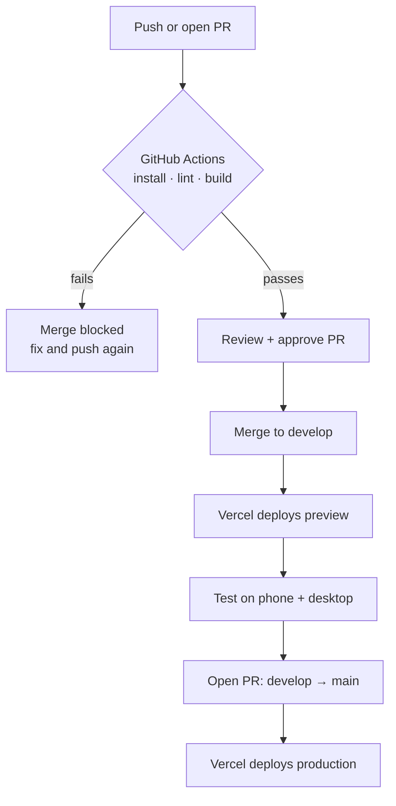
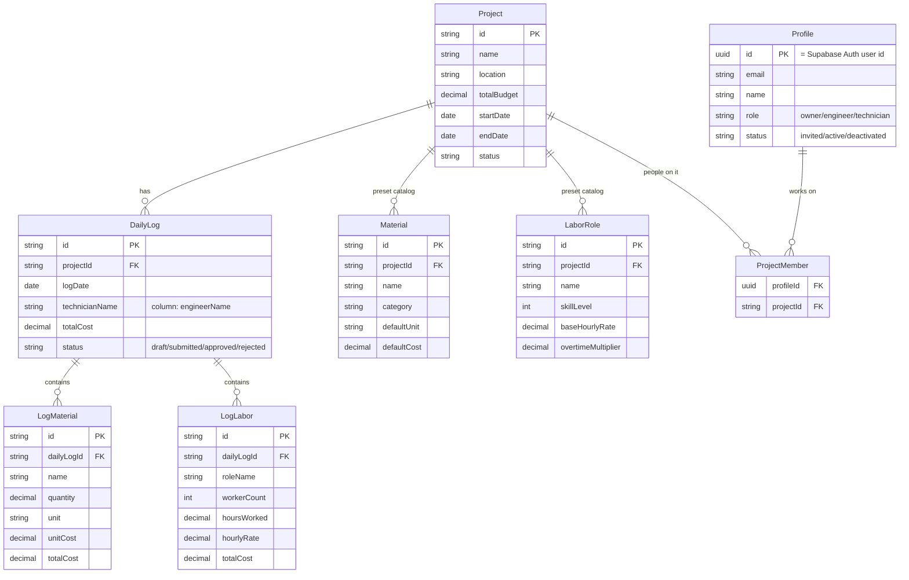

# SiteTrack Albania — Architecture
 
> How the system is put together: cloud setup, environments, CI/CD, and the data model.
> Diagrams are Mermaid — they render in GitHub and VS Code, and stay editable as plain text.
> Read this when working on infrastructure, deployment, or the schema.
 
---
 
## Cloud setup
 
How code and data flow from the laptop to the people on site.
 

 
- **GitHub** holds the code. Work flows `feature/*` → `develop` → `main`.
- **Vercel** watches GitHub and deploys automatically: `develop` → a preview/test URL, `main` →
  the production URL that people on site use.
- **Supabase** is the database. The app (and local dev) read/write it.
---
 
## Environments
 
| Environment | Branch    | Where it runs        | Who sees it              |
|-------------|-----------|----------------------|--------------------------|
| Development | `develop` | Vercel preview URL   | Us — testing on phone + desktop |
| Production  | `main`    | Vercel production URL| Real users on the site   |
 
**Current state:** one Supabase project serves everything for now. Split into a separate
production database later — only when we're about to put it in front of the real technician.
 
---
 
## Development workflow
 
How one feature goes from idea to merged. The human + LLM loop that happens *before* the pipeline
below. (Rules for this live in `CLAUDE.md`; this is the shape of it.)
 

 
The PR then enters the pipeline below. One feature per branch keeps each loop — and each Claude
Code session — small and focused.
 
---
 
## CI/CD pipeline
 
What runs on every change, so broken code can't reach `develop` or `main`.
 

 
Branch protection on `main` and `develop` requires a PR + passing CI before merge — so nothing
untested lands on either.
 
---
 
## Data model
 
Source of truth: `prisma/schema.prisma`. Eight tables: the six cost tables, plus accounts
(`Profile`, `ProjectMember`).
 

 
Notes:
- One **DailyLog** per project per day (`@@unique([projectId, logDate])`).
- **Material** and **LaborRole** are per-project catalogs the technician picks from instead of typing.
- Money is always `Decimal`, never float. Cascade deletes from `Project` down to its logs/catalogs.
- **Profile** is one per person who can log in; its id is their Supabase Auth user id. Role and
  status live here, never in Supabase `user_metadata` (users can edit that).
- Row-level security is on for every table: the app only talks to the database through Prisma
  (as the tables' owner), so this just closes them to Supabase's public Data API.